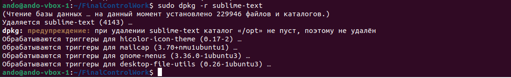
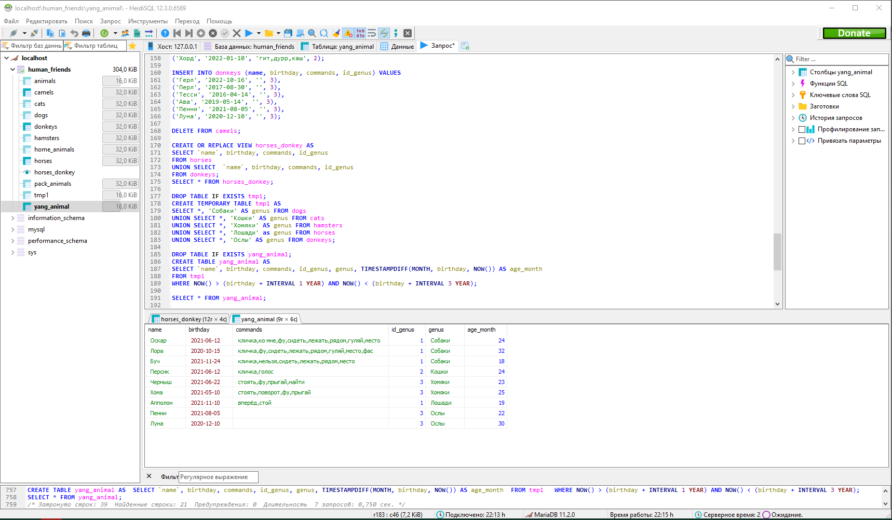

# Итоговая контрольная работа по блоку специализация
## Информация о проекте
Необходимо организовать систему учета для питомника в котором живут
домашние и вьючные животные.
## Задание
1. Используя команду cat в терминале операционной системы Linux, создать два файла Домашние животные (заполнив файл
   собаками, кошками, хомяками) и Вьючные животными заполнив файл Лошадьми, верблюдами и ослы), а затем объединить их.
   Просмотреть содержимое созданного файла.
   Переименовать файл, дав ему новое имя (Друзья человека).
2. Создать директорию, переместить файл туда.
3. Подключить дополнительный репозиторий MySQL. Установить любой пакет
   из этого репозитория.
4. Установить и удалить deb-пакет с помощью dpkg.
5. Выложить историю команд в терминале ubuntu
6. Нарисовать диаграмму, в которой есть класс родительский класс, домашние животные и вьючные животные, в составы
   которых в случае домашних животных войдут классы: собаки, кошки, хомяки, а в класс вьючные животные войдут:
   Лошади, верблюды и ослы).
7. В подключенном MySQL репозитории создать базу данных “Друзья человека”
8. Создать таблицы с иерархией из диаграммы в БД
9. Заполнить низкоуровневые таблицы именами(животных), командами которые они выполняют и датами рождения
10. Удалив из таблицы верблюдов, т.к. верблюдов решили перевезти в другой питомник на зимовку.
    Объединить таблицы лошади, и ослы в одну таблицу.
11. Создать новую таблицу “молодые животные” в которую попадут все животные старше 1 года, но младше 3 лет и в
    отдельном столбце с точностью до месяца подсчитать возраст животных в новой таблице
12. Объединить все таблицы в одну, при этом сохраняя поля, указывающие на прошлую принадлежность к старым таблицам.
13. Создать класс с Инкапсуляцией методов и наследованием по диаграмме.
14. Написать программу, имитирующую работу реестра домашних животных.
    В программе должен быть реализован следующий функционал:
    1. Завести новое животное
    2. определять животное в правильный класс
    3. увидеть список команд, которое выполняет животное
    4. обучить животное новым командам
    5. Реализовать навигацию по меню
15. Создайте класс Счетчик, у которого есть метод add(), увеличивающий̆
    значение внутренней̆int переменной̆на 1 при нажатие “Завести новое
    животное” Сделайте так, чтобы с объектом такого типа можно было работать в
    блоке try-with-resources. Нужно бросить исключение, если работа с объектом
    типа счетчик была не в ресурсном try и/или ресурс остался открыт. Значение
    считать в ресурсе try, если при заведения животного заполнены все поля.

## Выполнение задач
### Задача 1
+    создаем файлы и наполняем их данными

    cat > "Домашние животные.txt"
    Шарик,собака,2015
    Дуся,кошка,2016
    Вася,кошка,2022
    Мук,хомяк,2022
    Рич,собака,2018
    Люси,кошка,2021
    Фиона,кошка,2017
    Маврик,собака,2021
    Вега,собака,2019
    Снуп,хомяк,2020
    ^C
    cat > "Вьючные животные.txt"
    Жак,лошадь,2020
    Ерос,верблюд,2021
    Зулан,осел,2018
    Апполон,лошадь,2012
    Ворон,верблюд,2011
    Ежевика,осел,2011
    Гранит,лошадь,2018
    Дакар,верблюд,2019
    Зулан,осел,2014
    ^C
+    объединяем файлы
  
    cat "Домашние животные.txt" "Вьючные животные.txt" > "Все.txt"

скрин консоли

+    смотрим содержимое файла

    cat "Все.txt"

скрин 

+    переименуем файл

    mv "Все.txt" "Друзья человека.txt"

+    проверим переименование

    ls

### Задача 2

Создадим директорию и переместим файл туда.

    mkdir pets
    mv "Друзья человека.txt" ./pets

### Задача 3
Подключаем дополнительный репозиторий MySQL и установим пакет workbench-community
из этого репозитория.

    wget https://dev.mysql.com/get/mysql-apt-config_0.8.25-1_all.deb
    sudo dpkg -i mysql-apt-config_0.8.25-1_all.deb
    sudo apt-get update
    sudo apt-get install mysql-workbench-community

### Задача 4
Установим и удалим deb-пакет SublimeText с помощью dpkg. 

скачаем пакет

    wget https://download.sublimetext.com/sublime-text_build-4143_amd64.deb

установим пакет

    sudo dpkg -i sublime-text_build-4143_amd64.deb

Запускаем приложение. Все ОК.

Удалим пакет

    sudo dpkg -r sublime-text

### Задача 5

Выложить историю команд в терминале ubuntu

    history

### Задача 6
Нарисуем диаграмму, в которой есть родительский класс, домашние животные и вьючные животные, в составы которых в случае
домашних животных войдут классы: собаки, кошки, хомяки, а в класс вьючные животные войдут: Лошади, верблюды и ослы.

### Задача 7
В подключенном MySQL репозитории создать базу данных “Друзья человека”

    CREATE DATABASE human_friends;

### Задача 8
Создать таблицы с иерархией из диаграммы в БД

    USE human_friends;

    DROP TABLE IF EXISTS animals;
    CREATE TABLE animals
    (
    id INT AUTO_INCREMENT PRIMARY KEY,
    class_name tinytext
    );
    
    INSERT INTO animals (class_name) VALUES
    ('Домашние'),
    ('Вьючные');
    
    --
    
    DROP TABLE IF EXISTS home_animals;
    CREATE TABLE home_animals
    (
    id INT AUTO_INCREMENT PRIMARY KEY,
    genus_name tinytext,
    id_сlass INT,
    FOREIGN KEY (id_сlass) REFERENCES animals (id) ON DELETE CASCADE ON UPDATE CASCADE
    );
    
    INSERT INTO home_animals (genus_name, id_сlass) VALUES
    ('Собаки', 1),
    ('Кошки', 1),  
    ('Хомяки', 1);
    
    DROP TABLE IF EXISTS pack_animals;
    CREATE TABLE pack_animals
    (
    id INT AUTO_INCREMENT PRIMARY KEY,
    genus_name tinytext,
    id_сlass INT,
    FOREIGN KEY (id_сlass) REFERENCES animals (id) ON DELETE CASCADE ON UPDATE CASCADE
    );
    
    INSERT INTO pack_animals (genus_name, id_сlass) VALUES
    ('Лошади', 2),
    ('Верблюды', 2),  
    ('Ослы', 2);
    
    -- home_animals tables --
    
    DROP TABLE IF EXISTS dogs;
    CREATE TABLE dogs
    (       
    id INT AUTO_INCREMENT PRIMARY KEY,
    name tinytext,
    birthday DATE,
    commands tinytext,
    id_genus int,
    FOREIGN KEY (id_genus) REFERENCES home_animals (id) ON DELETE CASCADE ON UPDATE CASCADE
    );
    
    
    DROP TABLE IF EXISTS cats;
    CREATE TABLE cats
    (       
    id INT AUTO_INCREMENT PRIMARY KEY,
    name tinytext,
    birthday DATE,
    commands tinytext,
    id_genus int,
    FOREIGN KEY (id_genus) REFERENCES home_animals (id) ON DELETE CASCADE ON UPDATE CASCADE
    );
    
    
    DROP TABLE IF EXISTS hamsters ;
    CREATE TABLE hamsters  
    (       
    id INT AUTO_INCREMENT PRIMARY KEY,
    name tinytext,
    birthday DATE,
    commands tinytext,
    id_genus int,
    FOREIGN KEY (id_genus) REFERENCES home_animals (id) ON DELETE CASCADE ON UPDATE CASCADE
    );
    
    -- pack_animals tables ---
    
    DROP TABLE IF EXISTS horses;
    CREATE TABLE horses  
    (       
    id INT AUTO_INCREMENT PRIMARY KEY,
    name tinytext,
    birthday DATE,
    commands tinytext,
    id_genus int,
    FOREIGN KEY (id_genus) REFERENCES pack_animals (id) ON DELETE CASCADE ON UPDATE CASCADE
    );
    
    DROP TABLE IF EXISTS camels;
    CREATE TABLE camels  
    (       
    id INT AUTO_INCREMENT PRIMARY KEY,
    name tinytext,
    birthday DATE,
    commands tinytext,
    id_genus int,
    FOREIGN KEY (id_genus) REFERENCES pack_animals (id) ON DELETE CASCADE ON UPDATE CASCADE
    );
    
    DROP TABLE IF EXISTS donkeys;
    CREATE TABLE donkeys  
    (       
    id INT AUTO_INCREMENT PRIMARY KEY,
    name tinytext,
    birthday DATE,
    commands tinytext,
    id_genus int,
    FOREIGN KEY (id_genus) REFERENCES pack_animals (id) ON DELETE CASCADE ON UPDATE CASCADE
    );

### Задача 9
Заполнить низкоуровневые таблицы именами(животных), командами которые они выполняют и датами рождения

    -- home_animals tables data --
    
    INSERT INTO dogs (name, birthday, commands, id_genus) VALUES
    ('Вита', '2015-05-03', 'кличка,ко мне,фу,нельзя,сидеть,лежать,рядом,гуляй,место,фас', 1),
    ('Оскар', '2021-06-12', 'кличка,ко мне,фу,сидеть,лежать,рядом,гуляй,место', 1),  
    ('Грей', '2022-09-18', 'кличка,ко мне,нельзя,сидеть', 1),
    ('Жужа', '2018-12-10', 'кличка,ко мне,нельзя,сидеть,лежать,рядом,место', 1),
    ('Лора', '2020-10-15', 'кличка,фу,сидеть,лежать,рядом,гуляй,место,фас', 1),
    ('Буч', '2021-11-24', 'кличка,нельзя,сидеть,лежать,рядом,место', 1);
    
    INSERT INTO cats (name, birthday, commands, id_genus) VALUES
    ('Рубик', '2020-01-09', 'кличка,ко мне', 2),
    ('Персик', '2021-06-12', 'кличка,голос', 2),  
    ('Ася', '2017-12-04', 'кличка,голос,ко мне', 2),
    ('Фиона', '2018-08-21', 'кличка,сидеть,ползи,принеси,голос,прыжок,ко мне', 2),
    ('Смоки', '2019-05-11', 'кличка,сидеть,ползи,принеси,голос,прыжок,ко мне', 2),
    ('Лиззи', '2022-07-08', 'кличка,кис-кис', 2);
    
    INSERT INTO hamsters (name, birthday, commands, id_genus) VALUES
    ('Банни', '2020-01-08', 'стоять,поворот,фу,прыгай,найти', 3),
    ('Черныш', '2021-06-22', 'стоять,фу,прыгай,найти', 3),  
    ('Бонни', '2019-05-16', 'стоять,поворот,фу,прыгай,найти', 3),
    ('Джей', '2018-05-30', 'стоять,поворот,фу', 3),
    ('Винни', '2018-12-31', 'стоять,фу,найти', 3),
    ('Хома', '2021-05-10', 'стоять,поворот,фу,прыгай', 3);
    
    -- pack_animals tables data --
    
    INSERT INTO horses (name, birthday, commands, id_genus) VALUES
    ('Виконт', '2015-01-24', 'вперёд,стой,рысь,хоп,шагом,тише', 1),
    ('Буран', '2019-03-28', 'вперёд,стой,тише', 1),  
    ('Базилик', '2016-09-12', 'вперёд,стой,рысь,хоп,шагом', 1),
    ('Гранат', '2016-07-09', 'вперёд,стой,рысь,хоп,шагом,тише', 1),
    ('Астон', '2018-09-14', 'вперёд,стой,рысь,хоп', 1),
    ('Апполон', '2021-11-10', 'вперёд,стой', 1);
    
    INSERT INTO camels (name, birthday, commands, id_genus) VALUES
    ('Блум', '2022-01-23', 'гит,дурр,каш', 2),
    ('Шоко', '2017-08-17', 'гит,дурр,каш,цок-цок', 2),  
    ('Либур', '2016-02-09', 'гит,дурр,каш,хап-хап', 2),
    ('Патрик', '2019-02-25', 'гит,дурр,каш,кхх-кхх', 2),
    ('Фуксия', '2012-06-05', 'гит,дурр,каш,цок-цок,хап-хап,кхх-кхх', 2),
    ('Хорд', '2022-01-10', 'гит,дурр,каш', 2);
    
    INSERT INTO donkeys (name, birthday, commands, id_genus) VALUES
    ('Герл', '2022-10-16', '', 3),
    ('Перл', '2017-08-30', '', 3),  
    ('Тесси', '2016-04-14', '', 3),
    ('Ава', '2019-05-14', '', 3),
    ('Пенни', '2021-08-05', '', 3),
    ('Луна', '2020-12-10', '', 3);

### Задача 10
Удалив из таблицы верблюдов, т.к. верблюдов решили перевезти в другой питомник на зимовку.
Объединить таблицы лошади, и ослы в одну таблицу.

    DELETE FROM camels;

    CREATE OR REPLACE VIEW horses_donkey AS
    SELECT name, birthday, commands, id_genus
    FROM horses
    UNION SELECT  name, birthday, commands, id_genus
    FROM donkeys;
    SELECT * FROM horses_donkey;

### Задача 11
Создать новую таблицу “молодые животные” в которую попадут все животные старше 1 года,
но младше 3 лет и в отдельном столбце с точностью до месяца подсчитать возраст животных в новой таблице

    DROP TABLE IF EXISTS tmp1;
    CREATE TEMPORARY TABLE tmp1 AS
    SELECT *, 'Собаки' AS genus FROM dogs
    UNION SELECT *, 'Кошки' AS genus FROM cats
    UNION SELECT *, 'Хомяки' AS genus FROM hamsters
    UNION SELECT *, 'Лошади' as genus FROM horses
    UNION SELECT *, 'Ослы' AS genus FROM donkeys;

    DROP TABLE IF EXISTS yang_animal;
    CREATE TABLE yang_animal AS
    SELECT `name`, birthday, commands, id_genus, genus, TIMESTAMPDIFF(MONTH, birthday, NOW()) AS age_month
    FROM tmp1
    WHERE NOW() > (birthday + INTERVAL 1 YEAR) AND NOW() < (birthday + INTERVAL 3 YEAR);
    
    SELECT * FROM yang_animal;

### Задача 12
Объединить все таблицы в одну, при этом сохраняя поля, указывающие на прошлую принадлежность к старым таблицам.

    SELECT
	    h.name, h.birthday, h.commands, h.id_genus,
	    pa.genus_name,
	    IFNULL(ya.age_month,TIMESTAMPDIFF(MONTH, h.birthday, NOW())) AS age_month 
    FROM horses h
    LEFT JOIN yang_animal ya ON ya.name = h.name
    LEFT JOIN pack_animals pa ON pa.id = h.id_genus
    UNION
    SELECT
        dk.name, dk.birthday, dk.commands, dk.id_genus,
        pa.genus_name,
        IFNULL(ya.age_month,TIMESTAMPDIFF(MONTH, dk.birthday, NOW())) AS age_month
    FROM donkeys dk
    LEFT JOIN yang_animal ya ON ya.name = dk.name
    LEFT JOIN pack_animals pa ON pa.id = dk.id_genus
    UNION
    SELECT
        c.name, c.birthday, c.commands, c.id_genus,
        ha.genus_name,
        IFNULL(ya.age_month,TIMESTAMPDIFF(MONTH, c.birthday, NOW())) AS age_month
    FROM cats c
    LEFT JOIN yang_animal ya ON ya.name = c.name
    LEFT JOIN home_animals ha ON ha.id = c.id_genus
    UNION
    SELECT
        d.name, d.birthday, d.commands, d.id_genus,
        ha.genus_name,
        IFNULL(ya.age_month,TIMESTAMPDIFF(MONTH, d.birthday, NOW())) AS age_month
    FROM dogs d
    LEFT JOIN yang_animal ya ON ya.name = d.name
    LEFT JOIN home_animals ha ON ha.id = d.id_genus
    UNION
    SELECT
        hm.name, hm.birthday, hm.commands, hm.id_genus,
        ha.genus_name,
        IFNULL(ya.age_month,TIMESTAMPDIFF(MONTH, hm.birthday, NOW())) AS age_month
    FROM hamsters hm
    LEFT JOIN yang_animal ya ON ya.name = hm.name
    LEFT JOIN home_animals ha ON ha.id = hm.id_genus;

### Задача 13
Создать класс с Инкапсуляцией методов и наследованием по диаграмме.
[Модель классов](https://github.com/ando7667/FinalControlWork/tree/dev/src/Models)

### Задача 14
Написать программу, имитирующую работу реестра домашних животных.

Подключил коннектор MariaDB для работы с базой данных;
Добавил методы вывода нужной таблицы питомцев и записи нового питомца в таблицу.
Добавил методы работы с командами для животного.
Реализовал меню.
[Программа](https://github.com/ando7667/FinalControlWork/blob/main/src)
Добавил класс сетчик ( Counter ) и методы для работы с ним.
[Класс Счетчик](https://github.com/ando7667/FinalControlWork/blob/main/src/Services/AnimalCounter.java)

